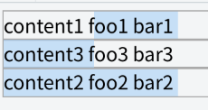
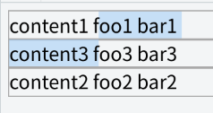

# Minimal multi ranges explained

Chrome implements user selection as one [Range](https://www.w3.org/TR/dom/#range), which represents a range
 on a document like ```{nodeA, 5, nodeB, 3}```.  
However, there are cases where user want to select contents which can not
be represented with one Range.  
Chrome wants to offer such selection for user and/or web author balancing between capability and stability.  
I propose multi range functionality, which is opt-in, made from StaticRange and accepts a few execCommands.

## Cases we need multiple ranges
### Ctrl-click
On Firefox, user can select discontigous DOM Range with ctrl-click/drag.  
  
#### Table
  
User can't select so on Chrome.

### Grid Layout
Following code demostrate grid layout reorder.
```html
<style>
.root { display: grid;}
.root > div { outline: solid 1px #aaa;}
</style>
<div class=root>
<div style="grid-row:1">content1 foo1 bar1</div>
<div style="grid-row:3">content2 foo2 bar2</div>
<div style="grid-row:2">content3 foo3 bar3</div>
</div>
```
In that case, user drag from first grid to second one to select ```'oo1 bar1 content3 f'```
 but ```'content2 foo2 bar2'``` of third grid is included.  
  
We want multiple ranges of ```{'content1 foo1 bar1', 10, 'content1 foo1 bar1', 18}``` and
```{'content3 foo3 bar3', 0, 'content3 foo3 bar3', 10}``` so that user selects:  
  

### Shadow DOM
Following code demostrate Shadow DOM layout nodes reorder.
```html
out
<span id=host>
 <span slot=s1>foo1</span>
 <span slot=s2>bar2</span>
</span>
<script>
 host.attachShadow({mode:"open"}).innerHTML =
  "<slot name=s2></slot><slot name=s1></slot>";
</script>
```
If user select from ```'out'``` to ```'bar2'```, chrome selects them excluding ```'foo1'```.  
  
However, ```getSelection().getRangeAt(0)``` returns Range of ```{'out',1, 'bar2', 2}``` that includes
```'foo1'```.  
We want multiple ranges of ```{'out', 1, 'out', 3}``` and
```{'bar2', 0, 'bar2', 2}``` so that web author can know which nodes in root document are exactly selected.  
(There is ```host.ShadowRoot.getSelection()``` which is not ```doument.getSelection()```. What ranges ```host.ShadowRoot.getSelection()``` represents in this case is also topic but since the user agent
should not expose Shadow DOM to```doument.getSelection()```, that is another theme.)

## Problems to implement full multiple Ranges 
If we simply implement such multiple Ranges on ```addRange()```,```rangeCount``` and ```getRangeAt()```,
there are many issues:
- Backward compatibility
  - Many sites assume user selection is a Range and use only ```getRangeAt(0)```, which
returns the Range of {\<start of mouse drag>, \<end of mouse drag>}. That is broken on the grid layout and Shadow DOM cases. 
- Performance
  - Range should mutate syncronousely for DOM mutation(
[spec](https://www.w3.org/TR/2000/PR-DOM-Level-2-Traversal-Range-20000927/ranges.html#Level-2-Range-Mutation)).
It means if there are more Ranges, DOM mutation performance gets worse.
- Complexity:
  - What if there are overlrapping ranges? 
  - ```insertOrderedList``` or other execCommands assumpt one Range.

## Proposed API
### Opt-in selection mode
The user agent has a couple of entry points to create multiple Ranges.
```javascript
document.getSelection().modes = ['multiple-user-ctrl', 'multiple-user-layout', 'multiple-addstaticrange'];
```
Default ```modes``` are empty array, on which the user agent behaves as-is.  
Setting ```modes``` enables multiple ranges:
- ```'multiple-user-ctrl'``` enables user to create multiple ranges with ctrl-click/drag:  

- ```'multiple-user-layout'``` enables user to create multiple ranges with drag/shift-arrowkey on layout order:  
  
- ```'multiple-addstaticrange'``` enables webauthor to create multiple ranges with ```addStaticRange()``` and ```getStaticRanges()``` methods:  

```javascript
        for (let range of getSelection().getStaticRanges()) myDb.bookmarkUserSelection(range);
```
You can set any combination of mode:
```javascript
document.getSelection().modes = ['multiple-user-layout', 'multiple-addstaticrange'];
```

### No overlapping Range
Any mode doesn't create/allow overwrapping Ranges.

### Editing functionality for user
If ```'multiple-user-ctrl'```  and/or ```'multiple-user-layout'``` turn on
 and there is selection,
the user agent offers user a few editing functionality:
- copy  
So that user can get contents they are selecting.  

- delete, cut(copy + delete), undo, redo
If ```modes``` include ```multiple-user-ctrl```.

- (I'm considering the operation inserting text onto multiple ranges simultaniously.
Web author can implement it with
[Input Events](https://www.w3.org/TR/input-events-2/) if the user agent passes multiple ranges
through ```getTargetRanges()```. Ditto to delete and cut.)

We say selection is DOM-contiguous if there is only one StaticRange or a caret.  
Selection is DOM-contiguous if ```getSelection().getStaticRanges().length == 1```  
If selection is DOM-contiguous, the user agent offers exisiting functionality
(text input, expanding selection, execCommand, etc...).  
(can it also accepets one "visible-contiguous" Range on ```'multiple-user-layout'``` mode?)

### Editing API for web author

#### StaticRange API.
```javascript
document.getSelection().addStaticRange(nodeA, 0, nodeB, 3);
```
That's all, but it throws exception if added StaticRange overwrapps existing ```getStaticRanges()```.  
(what if ```addStaticRange()``` on ```'multiple-user-layout'``` ?)    
(throwing exception or merging into existing one is a topic)
You get all ranges with ```getStaticRanges()```:
```javascript
for (let range of getSelection().getStaticRanges()) {
  // Do "static" opration like
  myDb.bookmarkUserSelection(range);
}
```
(Order of ranges are not decided yet. Just appended order as user drag and ```addStaticRange()```?) 

If web author wants to edit content and keep live Ranges, they might
create Range from StaticRange.
```javascript
let ranges = [];
// Collect all ranges before editing.
for (let range of getSelection().getStaticRanges()) {
  let domrange = document.createRange();
  domrange.setStart(range.startContainer, range.startOffset);
  domrange.setEnd(range.endContainer, range.endOffset);
  ranges.push(domrange);
}
for (let domrange of ranges) {
  // Do "dynamic" opration like
  unbold(domrange);
}
```

#### Invalidating existing Range API.
If selection is not contiguous,  ```rangeCount```, ```addRange()```, ```getRangeAt()``` and ```removeRange()``` always throws exception.  (any other APIs to consider?)
Web author should interect selection ranges through ```getStaticRanges()``` and 
```addStaticRange()```.  
We can clear selection with ```removeAllRanges()```.

#### Limited execCommand
If selection is not contiguous, only 'copy', 'undo', 'redo' are allowed because many execCommands are 'macro' operation
 of DOM mutation on one Range.
