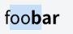

# [Selection API](https://www.w3.org/TR/selection-api/) prospotion for [Shadow DOM](https://www.w3.org/TR/shadow-dom/)
In this document, I explain Selection API issues on Shadow DOM and propose spec modification.  

Selection API defines selection as it is unique on a ducument which consists of one node tree.  
However, Shadow DOM inserts other node trees into a document recursively and we don't expose contents in the trees with javascript API.  
That has made Selection API not working for Shadow DOM.([reported issue](https://github.com/w3c/webcomponents/issues/79))  
Also there are interop issues between user agents' implementation.  

## Selection API Example
Following code illustrates a normal text and a bold text:
```html
foo<b>bar</b>
```
  
If the user drag mouse from ```'foo'``` to ```'bar'```,  
  
In this situation, ```document.getSelection()``` returns a Selection associated with a Range of ```{'foo',1, 'bar', 1}```.  

## Support table
|                           |   Chrome  | Safari | Firefox | Edge |
|------------               |:---------:|:------:|:------:|:------:|
| ```document.getSelection()```   |    ✔️     |   ✔️   |✔️|✔️|
| Shadow DOM                |  ✔️       | ✔️     | (in development) | (under consideration) | 
| User selection for Shadow | ❗(see example) | ❗(see example)  | N/A| N/A |
| ```shadowRoot.getSelection()``` |  ❗(see example)      |  ```undefined```  | N/A| N/A |

## Shadow DOM Examples
Following code illustrates very simple Shadow DOM:
```html
outer<span id=host></span>
<script>
host.attachShadow({mode:'open'}).innerHTML = 'inner';
</script>
```
  

Let's see what happens if the user drags mouse in various ways.

### #1. outer->inner  
The user drags mouse from ```'outer'``` to ```'inner'```.  

|                           |   Chrome  | Safari |
|------------               |:---------:|:------:|
| User selection            |   |    |
| ```document.getSelection()``` |  ```{‘outer’,2, ‘outer’, 5}```      |  ```{‘outer’,2, ‘outer’, 5}```  |
| ```shadowRoot.getSelection()``` |  empty     |  N/A  |

### #2. inner->outer  
The user drags mouse from ```'inner'``` to ```'outer'```.  

|                           |   Chrome  | Safari |
|------------               |:---------:|:------:|
| User selection            |   |    |
| ```document.getSelection()``` |  ```{document.body, 1,```<br>```  document.body, 1}```      |  ```{document.body, 1,```<br>```  document.body, 1}```  |
| ```shadowRoot.getSelection()``` |  ```{‘inner’, 3, ‘inner’, 0}```     |  N/A  |

### #3. Only inner  
The user drags mouse inside ```'inner'```.  

|                           |   Chrome  | Safari |
|------------               |:---------:|:------:|
| User selection            |   |    |
| ```document.getSelection()``` |  ```{document.body, 1,```<br>```  document.body, 1}```      |  ```{document.body, 1,```<br>```  document.body, 1}```  |
| ```shadowRoot.getSelection()``` |  ```{‘inner’, 1, ‘inner’, 4}```     |  N/A  |

## Key points
- The user can copy hilight text in any case.
- For user interaction, Safari follows current spec which prohibits the user to select crossing shadow but permits to select inner shadow.
- If selection starts from document, any ```document.getSeletion()``` returns the Range includes at least selected top level nodes.
- If selection starts from Shadow DOM,  ```document.getSeletion()``` behaves like shadow tree is INPUT element.  

Though there are many other cases like outer->inner->moreinner, inner->outer->anotherinner, I want to get a consensus about this simplest case first. 

## Proposition
The user can select contents crossing shadow boundary.  

|                           |  Proposition |
|------------               |:---------:|
| User selection            |   |
| ```document.getSelection()``` |  ```{‘outer’,2, document.body, 2}```      |  
| ```shadowRoot.getSelection()``` |  ```{host.shadowRoot, 0, ‘inner’, 3}```     |  

- ```document.getSelection()``` ending ```document.body, 2``` indicates selection contains the shadow host element.
- ```shadowRoot.getSelection()``` starting ```host.shadowRoot, 0``` indicates selection starts from the beggining of the shadow root.  
- If web author wants to control user selection, recommend using [CSS user-select property](https://www.w3.org/TR/css-ui-

If the user selects inside shadow,

|                           |  Proposition |
|------------               |:---------:|
| User selection            |   |
| ```document.getSelection()``` |  ```{document.body, 1, document.body, 2}```      |  
| ```shadowRoot.getSelection()``` |  ```{'inner', 1, ‘inner’, 4}```     |  

- ```document.getSelection()```  indicates selection contains the shadow host element.


