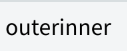

# [Selection API](https://www.w3.org/TR/selection-api/) prospotion for [Shadow DOM](https://www.w3.org/TR/shadow-dom/)
In this document, I explain selection issues on Shadow DOM and propose spec modification.  
**This proposition is NOT about [multiple Ranges](https://github.com/w3c/selection-api/issues/41).**

## Selection API Example w/o Shadow
Following code illustrates a normal text and a bold text:
```html
foo<b>bar</b>
```
  
If the user drag mouse from ```'foo'``` to ```'bar'```,  
  
```document.getSelection()``` returns a singleton Selection object per document. 
In this situation, ```document.getSelection().getRangeAt(0)``` returns a Range of ```{'foo',1, 'bar', 2}```.
It means "a range after 'f' in 'foo' node to after 'a' in  'bar' node.  
If no selection, ```document.getSelection().rangeCount``` returns ```0``` so that web author might not call ```getRangeAt(0)```.

Selection API also offers setting user selection by javascript:
```javascript
let range = document.createRange();
let foo = document.body.firstChild;
let bar = foo.nextSibling.firstChild;
range.setStart(foo, 1);
range.setEnd(bar, 2);
document.getSelection().addRange(range);
```
This makes same selection.

## Case 1: Creating own editor.
Following code illustrates a tiny text editor:
```html
foo
<x-editor></x-editor>
<script>
customElements.define('x-editor', class extends HTMLElement {
  constructor() {
    super();
    const root = this.attachShadow({mode: 'closed'});
    root.innerHTML = `
      <div style="border: 1px solid black; width:100px">
        <input type="button" value="bold">
        <div contenteditable>edit area</div>
      </div>`;
    root.querySelector('input').onclick = () => {
      console.log(document.getSelection());
      console.log(root.getSelection());
    };
  }
});
</script>
```
  
The web author wants selected range to boldize.  

In this case, the Shadow author should be get selected Range inside Shadow but the Document author should
not know.

## Case 2: User selection crossing Shadow DOM

Following code illustrates very simple Shadow DOM:
```html
outer<span id=host></span>
<script>
host.attachShadow({mode:'open'}).innerHTML = 'inner';
</script>
```
  

We should permit user to select contents over Shadow boundary.

|   From | To                        | Expected  |
|--------|----               |:---------:|
| ```'outer'``` | ```'inner'```   |   | 
|  ```'inner'``` | ```'outer'```        |   | 
| ```'inner'``` | ```'inner'```             |   | 

The Shadow author can control if user can select crossing Shadow boundary with [CSS user-select property](https://www.w3.org/TR/css-ui-4/#propdef-user-select).  

## Spec and implementation history
Selection API defines selection as it is unique per Document which consists of one node tree. ```document.getSelection()``` returns a singleton Selection object. If there is a selection, Selection must have a Range, which start and end root's must be
Document and each browser implemented so (Firefox has multiple Ranges but they are also rooted to Document). 

However, Shadow DOM inserts other node trees into Document. Nodes participate in ShadowRoot are rooted to ShadowRoot, which is not Document.  

Thus, we can't create a Range crossing Shadow Boundary and such selection.

Selection API also specified that Document has a unique selection associated with it. Then Chrome doesn't follow it. The user agent can't create another Selection object for ShadowRoot. If it has, interactions between them are undifined. 

We need update Selection API working well for Shadow DOM.

# General proposition
Update Selection API. Since there would be bunch of discussions/updates, I want to join spec work.

## Proposition for crossing Shadow boundary
Let the web author controling if user can select crossing Shadow boundary with [CSS user-select property](https://www.w3.org/TR/css-ui-4/#propdef-user-select).  
User-select property has 5 values of ```auto```, ```text```, ```none```, ```contain```, ```all```.  
```user-select:contain``` encapsuls selection like INPUT element:
```html
outer<span id=host></span>
<script>
host.attachShadow({mode:'open'}).innerHTML =
  '<style>:host { user-select: contain; }</style>' 
  + 'inner';
</script>
```

As default, the user can select crossing Shadow boundary.
I also propose '''getRangeAt(0)''' modification that the web author can get its selection correctly. See appendix.

# Appendix

## Support table
|                           |     |  |  |  |
|------------               |:---------:|:------:|:------:|:------:|
| ```document.getSelection()```   |    ✔️     |   ✔️   |✔️|✔️|
| Shadow DOM                |  ✔️       | ✔️     | (in development) | (under consideration) | 
| User selection for Shadow | ❗(see example) | ❗(see example)  | N/A| N/A |
| ```shadowRoot.getSelection()``` |  ❗(see example)      |  ```undefined```  | N/A| N/A |

Chrome and Safari implement Shadow DOM.  
Chrome implements ```shadowRoot.getSelection()```, which returns an unique Selection object per ShadowRoot.  
Both user selection and javascript API on each browser don't work well for Shadow DOM. Let's see it.

### Case 1: Creating own editor.
Following code illustrates a tiny text editor:
```html
foo
<x-editor></x-editor>
<script>
customElements.define('x-editor', class extends HTMLElement {
  constructor() {
    super();
    const root = this.attachShadow({mode: 'closed'});
    root.innerHTML = `
      <div style="border: 1px solid black; width:100px">
        <input type="button" value="bold">
        <div contenteditable>edit area</div>
      </div>`;
    root.querySelector('input').onclick = () => {
      console.log(document.getSelection());
      console.log(root.getSelection());
    };
  }
});
</script>
```
  
The web author wants selected range to boldize.  
What's happen?

|                           |     |   |
|------------               |:---------:|:------:|
| ```document.getSelection().getRangeAt(0)``` |  ```{document.body, 1, document.body, 1}```      |  ```{document.body, 1, document.body, 1}```   |
| ```shadowRoot.getSelection().getRangeAt(0)``` |  ```{'edit area', 2, 'edit area', 7}```     |  N/A  |

- ```shadowRoot.getSelection()``` returns expected Range on Chrome. Even ```document.execCommand('bold')``` works.
- ```document.getSelection()``` on both browsers are same, but ```{document.body, 1, document.body, 1}``` means a caret between ```'foo'``` and  ```<x-editor>```

### Case 2: User selection crossing Shadow DOM

Following code illustrates very simple Shadow DOM:
```html
outer<span id=host></span>
<script>
host.attachShadow({mode:'open'}).innerHTML = 'inner';
</script>
```
  

Let's see what happens if the user drags mouse over Shadow boundary.

|   From | To                        |     |   |
|--------|----               |:---------:|:------:|
| ```'outer'``` | ```'inner'```   |   |    |
|  ```'inner'``` | ```'outer'```        |   |    |
| ```'inner'``` | ```'inner'```             |   |    |

- User can copy highlight text at any case.
- Chrome allows the user crossing Shadow boundary but ```document.getSelection()``` and/or ```shadowRoot.getSelection()``` don't return correct higlight Ranges(see detail).
- Safari prohibits the user crossing Shadow boundary but If user select from Shadow, the web author can't get its selection Range.


## User select Shadow DOM Detail
What happens if ```getRangeAt(0)``` is called on user drag?
```html
outer<span id=host></span>
<script>
host.attachShadow({mode:'open'}).innerHTML = 'inner';
</script>
```

### #1. outer->inner  
The user drags mouse from ```'outer'``` to ```'inner'```.  

|                           |     |   |
|------------               |:---------:|:------:|
| User selection            |   |    |
| ```document.getSelection().getRangeAt(0)``` |  ```{‘outer’,2, ‘outer’, 5}```      |  ```{‘outer’,2, ‘outer’, 5}```  |
| ```shadowRoot.getSelection().getRangeAt(0)``` |  (throw exception because no range)     |  N/A  |

- Chrome allows the user going int Shadow DOM. It violates spec.
- Safari prohibits the user go into Shadow DOM. It follows spec.
- User can copy highlight text.
- At any case, shadow author can't know its content is selected.

### #2. inner->outer  
The user drags mouse from ```'inner'``` to ```'outer'```.  

|                           |     |   |
|------------               |:---------:|:------:|
| User selection            |   |    |
| ```document.getSelection()``` |  ```{document.body, 1,```<br>```  document.body, 1}```      |  ```{document.body, 1,```<br>```  document.body, 1}```  |
| ```shadowRoot.getSelection()``` |  ```{‘inner’, 3, ‘inner’, 0}```     |  N/A  |

### #3. Only inner  
The user drags mouse inside ```'inner'```.  

|                           |     |   |
|------------               |:---------:|:------:|
| User selection            |   |    |
| ```document.getSelection()``` |  ```{document.body, 1,```<br>```  document.body, 1}```      |  ```{document.body, 1,```<br>```  document.body, 1}```  |
| ```shadowRoot.getSelection()``` |  ```{‘inner’, 1, ‘inner’, 4}```     |  N/A  |

## Proposition1 Detail
Let's look at example again:
```html
outer<span id=host></span>
<script>
host.attachShadow({mode:'open'}).innerHTML = 'inner';
</script>
```
**The user can select contents crossing shadow boundary.**  

|                           |  Proposition |
|------------               |:---------:|
| User selection            |   |
| ```document.getSelection()``` |  ```{‘outer’,2, document.body, 2}```      |  
| ```shadowRoot.getSelection()``` |  ```{host.shadowRoot, 0, ‘inner’, 3}```     |  

- ```document.getSelection()``` ending ```document.body, 2``` indicates selection contains the shadow host element.
- ```shadowRoot.getSelection()``` starting ```host.shadowRoot, 0``` indicates selection starts from the beggining of the shadow root.  
- If web author wants to control user selection, recommend using [CSS user-select property](https://www.w3.org/TR/css-ui-4/#propdef-user-select).

If the user selects inside shadow,

|                           |  Proposition |
|------------               |:---------:|
| User selection            |   |
| ```document.getSelection()``` |  ```{document.body, 1, document.body, 2}```      |  
| ```shadowRoot.getSelection()``` |  ```{'inner', 1, ‘inner’, 4}```     |  

- ```document.getSelection()```  indicates selection contains the shadow host element.

### General algorithm
1. If selected node's root is ShadowRoot, host node is selected.
1. Each '''getSelection()''' is associated with a Range including such selected node.
